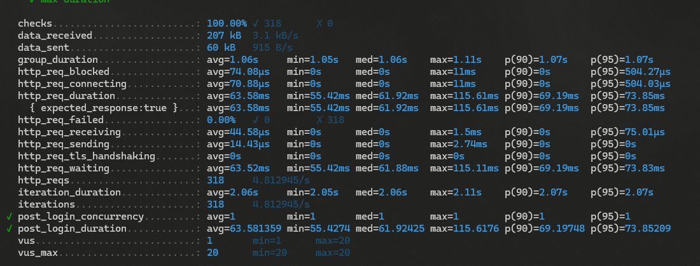
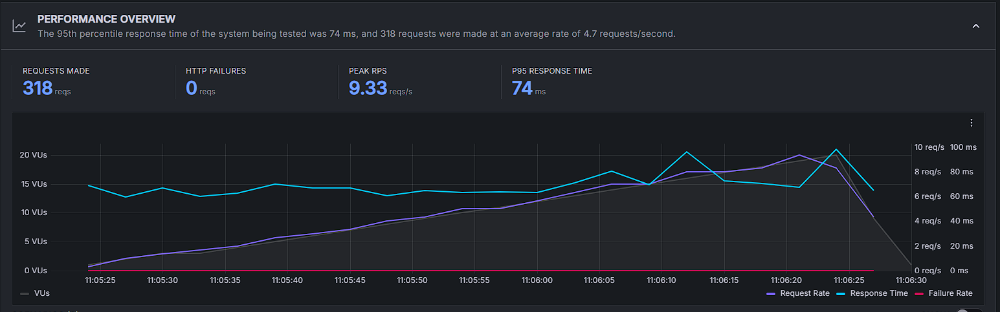
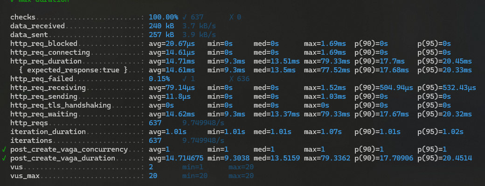
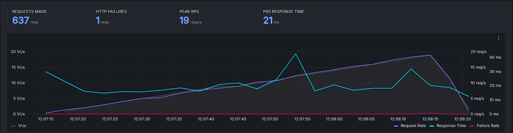

<!-- titulo: Medições do SLA -->
# Medições do SLA

* Teste realizado para todos os serviços: 
  - Ramp up com 10 VUs por 30s;
  - Adicionados mais 10 VUs por mais 30s (atingindo 20 VUs);
  - Ramp down por 30s

## Serviço - login 
* Endpoint: /api/auth/login
* Tipo de requisição: POST
* Tipo de operação: Leitura
* Arquivos envolvidos:
  - [index.ts](https://github.com/EasyParking-PI2/service-users/blob/main/src/index.ts)
  - [user.route.ts](https://github.com/EasyParking-PI2/service-users/blob/main/src/routes/user.route.ts)
  - [authMiddleware.ts](https://github.com/EasyParking-PI2/service-users/blob/main/src/middleware/authMiddleware.ts)
  - [AuthenticationController.ts](https://github.com/EasyParking-PI2/service-users/blob/main/src/controllers/AuthenticationController.ts)
  - [user.model.ts](https://github.com/EasyParking-PI2/service-users/blob/main/src/models/user.model.ts)
  - [RethinkDBConnection.ts](https://github.com/EasyParking-PI2/service-users/blob/main/src/infra/RethinkDBConnection.ts)
* Data de medição: 07/08/2024
* Descrição das configurações:
    - 1 Container docker com o serviço da aplicação rodando;
    - 1 Container docker com o serviço de banco de dados rodando (Mysql);
    - 1 Container docker com o serviço de autenticação rodando;
    - 1 Container docker com o serviço de banco de dados de autenticação rodando (RethinkDB);
* Testes de carga (SLA):
  
  
* Potenciais gargalos do sistema:
  - O tempo de resposta foi bastante alto para uma aplicação rodando em um ambiente local, porém se manteve estável durante quase todo o teste, atingindo alguns picos em 16 VUs e 20Vus;
  - A taxa de requisições manteve seu crescimento estável durante todo o teste, atingindo 9.33 requisições por segundo;
  - A aplicação conseguiu atingir o limite de requisições simultâneas que foi configurado para o teste (20VUs);

## Serviço - Inserir vaga
  * Endpoint: api/vagas
  * Tipo de requisição: POST
  * Tipo de operação: Leitura e escrita
  * Arquivos envolvidos:
    - [index.ts](https://github.com/EasyParking-PI2/application-service/blob/main/src/index.ts)
    - [vaga.rout.ts](https://github.com/EasyParking-PI2/application-service/blob/main/src/routes/vaga.route.ts)
    - [VagaController.ts](https://github.com/EasyParking-PI2/application-service/blob/main/src/controllers/VagaController.ts)
    - [Vaga.ts](https://github.com/EasyParking-PI2/application-service/blob/main/src/model/Vaga.ts)
    - [Models.ts](https://github.com/EasyParking-PI2/application-service/blob/main/src/model/Models.ts)
    - [DatabaseConnection.ts](https://github.com/EasyParking-PI2/application-service/blob/main/src/infra/DatabaseConnection.ts)
    - [authenticationMiddleware.ts](https://github.com/EasyParking-PI2/application-service/blob/main/src/middleware/authenticationMiddleware.ts)
    - [authenticationService.ts](https://github.com/EasyParking-PI2/application-service/blob/main/src/services/authentication.service.ts)
  * Data de medição: 07/08/2024
  * Descrição das configurações:
    - 1 Container docker com o serviço da aplicação rodando;
    - 1 Container docker com o serviço de banco de dados rodando (Mysql);
    - 1 Container docker com o serviço de autenticação rodando;
    - 1 Container docker com o serviço de banco de dados de autenticação rodando (RethinkDB);
  * Testes de carga (SLA):
    
    
  * Potenciais gargalos do sistema:
    - O tempo de requisição foi relativamente baixo para esse teste, atingindo um pico em 42.2ms;
    - A taxa de requisições por segundo manteve o crescimento estável durante todo o teste, atingindo o pico de 19 requisições por segundo;
    - A aplicação não atingiu o limite de requisições simultâneas estipulado pelo teste (20 VUs), atingindo 19 VUs;
    - O teste teve uma requisição com falha, que provavelmente ocorreu devido a repetição do número da vaga em duas requisições, pois foi definido no teste que essa variável iria assumir um valor aleatório para cada requisição. No entanto, existe uma chance pequena de que duas requisições enviem o mesmo valor, o que irá retornar um código de erro para a segunda requisição, pois a regra de negócio não permite que duas vagas possuam o mesmo número.  
